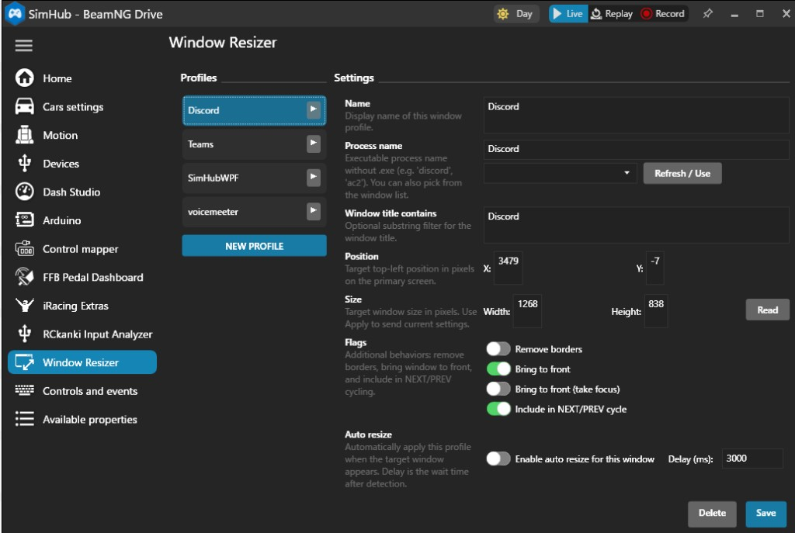

# WindowResizer

A **SimHub plugin** for Windows that saves **window layout profiles** (position, size, borderless, z-order) and applies them on demand or automatically. It is aimed at simulator rigs where you run **SimHub on one display** and **other apps** (telemetry browsers, Discord, streaming tools, secondary games, dashboards) on a **second monitor** or a dedicated screen area. You can **cycle or jump between profiles** so the “right” application is moved into a fixed viewport and brought forward—useful when you want to **swap what effectively occupies your sub-screen** without alt-tabbing through every window manually.

---

## Features

- **Named profiles** — Each profile stores display name, target process, optional window title substring filter, `X` / `Y` / `Width` / `Height`, and behavior flags.
- **Window picker** — Refresh the list of top-level windows and pick one to fill process/title fields (similar in spirit to desktop layout tools).
- **Per-profile actions** — Remove window borders, bring to front (with or without keyboard focus), include in **NEXT / PREV** cycle.
- **Auto-apply** — Optionally resize a window as soon as it appears (with configurable delay), then keep tracking it lightly while it stays open.
- **SimHub actions** — Bind buttons or encoders in SimHub to **next / previous profile**, **apply by profile name**, or a small **test move** of the foreground window.
- **Persistent storage** — Profiles are saved as JSON under SimHub’s base directory: `WindowResizer/profiles.json`.

### Settings UI (screenshot)



---

## First-time publish to GitHub

Use this when the project exists only on your PC and there is **no GitHub remote** yet.

1. On GitHub, click **New repository**. Use a name such as `WindowResizer`.
2. Create it **empty** (do **not** add README, `.gitignore`, or license on GitHub — this repo already has them).
3. In your local clone folder, add the remote and push (replace `USERNAME` and the repo name if different):

   ```bash
   git remote add origin https://github.com/USERNAME/WindowResizer.git
   git push -u origin master
   ```

   If your default branch is `main` instead of `master`, run `git branch -M main` before `git push -u origin main`.

4. When you are ready to publish a version, push the tag as well:

   ```bash
   git push origin v0.1.0
   ```

   Then on GitHub open **Releases → Create a new release**, choose that tag, attach `artifacts/WindowResizer-v0.1.0.zip` (see [`docs/RELEASE.md`](docs/RELEASE.md)), and paste notes from `CHANGELOG.md`.

---

## Installing from GitHub Releases

1. On GitHub, open this repository’s **Releases** page and download **`WindowResizer-v*.zip`** for the version you want.
2. Extract the ZIP. You should have `WindowResizer.dll`, `LICENSE`, `CHANGELOG.md`, and `INSTALL.txt`.
3. Follow **`INSTALL.txt`** (copy `WindowResizer.dll` into SimHub’s plugin folder, then restart SimHub if needed).
4. Optional: verify the ZIP with the **SHA-256** hash published in the release notes.

If you prefer to build from source, see [Building](#building). Maintainers: see [`docs/RELEASE.md`](docs/RELEASE.md) for tagging, checksums, and packaging with [`scripts/package-release.ps1`](scripts/package-release.ps1).

---

## Inspiration: Resize Raccoon

The design and several implementation details are **informed by [Resize Raccoon](https://github.com/mistenkt/resize-raccoon)** (a Tauri/Rust desktop tool for saving and applying window layouts, plus community extensions such as “Resize Raccoon Extended” where applicable). WindowResizer is **not a port or fork** of that project; it is a **SimHub-native plugin** written in C# / WPF, using **Win32** (`SetWindowPos`, `GetWindowLongPtr` / `SetWindowLongPtr`, foreground handling) in places that parallel Resize Raccoon–style logic (e.g. borderless toggling and “best match” window selection by process + title + geometry).

If you already think in terms of **profiles and picking windows from a list**, this plugin should feel familiar—while integrating with **SimHub’s action system** and **sim-racing workflows**.

---

## Why SimHub? Sub-screen / second-monitor switching

Many users run **SimHub fullscreen or borderless on the main monitor** and keep **another application** visible on a **secondary display** (or a fixed region of a large ultrawide). Typical examples:

- Telemetry or setup web apps  
- Voice chat (e.g. Discord)  
- OBS or stream deck–adjacent tools  
- A second title or companion window  

WindowResizer adds a **controller-centric** way to manage that: map **NEXT profile** / **PREV profile** to a wheel button or stream deck key so you **cycle which app is laid out into your predefined rectangle** and optionally **raised in the z-order**. That matches the mental model of **“switching what is shown on the sub screen”** even though SimHub itself does not host those apps—it **drives external Windows** to the layout you saved.

---

## Requirements

| Item | Notes |
|------|--------|
| **OS** | Windows (Win32 APIs). |
| **SimHub** | Installed; plugin targets the same environment as official SimHub plugins. |
| **.NET** | **.NET Framework 4.8** (see `WindowResizer.csproj`). |
| **Build** | Visual Studio or `dotnet build` with WPF workload; references point to SimHub’s shipped DLLs (see [Building](#building)). |

---

## Building

1. Clone this repository.
2. Open `WindowResizer.csproj` and, if needed, adjust **HintPath** entries so they match your SimHub install, for example:
   - `SimHub.Plugins.dll`
   - `GameReaderCommon.dll`
   - `Newtonsoft.Json.dll`  
   Default paths in the project assume:  
   `C:\Program Files (x86)\SimHub\`
3. Build **Release** (or Debug). Output: `WindowResizer.dll` (and dependencies if copied).

Install the DLL the same way you install other SimHub plugins (copy into SimHub’s plugin folder and restart SimHub if required—follow current SimHub documentation for plugin paths).

---

## Basic usage

### 1. Open the plugin settings

In SimHub, open **Settings** and select **WindowResizer** from the left menu (title: `WindowResizer`).

### 2. Create a profile

1. Click **NEW PROFILE** (under the profile list).  
2. Set **Name** (label for you and for **Apply by name**).  
3. Set **Process name** without `.exe` (e.g. `Discord`, `chrome`). Use **Refresh / Use** and the dropdown to pick a running window if you prefer.  
4. Optionally set **Window title contains** to disambiguate multiple windows from the same process.  
5. Set **Position** and **Size** (pixels, primary screen coordinates). Use **Read** to pull geometry from the matched window.  
6. Adjust **Flags** (borderless, bring to front, focus, include in NEXT/PREV).  
7. Optionally enable **Auto resize** and **Delay (ms)** so the layout applies when the window is detected.  
8. Click **Save**.

Use the **▶** button on a list row to **apply** that profile immediately (using the current form values).

### 3. Bind SimHub actions

Under SimHub **Controls** (or your preferred input mapping UI), assign hardware or virtual inputs to plugin actions:

| Action | Purpose |
|--------|---------|
| `WindowResizer.NextProfile` | Applies the next profile marked **Include in NEXT/PREV cycle**. |
| `WindowResizer.PrevProfile` | Applies the previous profile in that cycle. |
| `WindowResizer.ApplyProfileByName` | Applies a profile whose **Name** matches the string parameter (case-insensitive). |
| `WindowResizer.TestMoveActiveWindow` | Moves the **foreground** window to a fixed test rectangle (debug / sanity check). |

Only profiles with **Include in NEXT/PREV cycle** enabled participate in NEXT/PREV.

### 4. Typical “sub-screen” workflow

1. Create one profile per app/geometry (e.g. “Discord sub”, “Browser telemetry”, “Chat wide”).  
2. Enable **Include in NEXT/PREV cycle** on each profile you want in the rotation.  
3. Order in the list is the cycle order (NEXT advances in list order).  
4. Map **NextProfile** / **PrevProfile** to your wheel or button.  
5. Optionally use **Bring to front** / **take focus** per profile depending on whether you want SimHub to lose focus.

---

## Data and paths

- **Profiles file:** `<SimHub base directory>/WindowResizer/profiles.json`  
  (`SimHub base directory` is the folder SimHub uses as `AppDomain.CurrentDomain.BaseDirectory` for the running process—adjust if you use portable installs.)

Legacy entries that stored `ProcessName` with a trailing `.exe` are normalized on load.

---

## Limitations

- **Windows only** — Uses user32 / dwmapi.  
- **Foreground and focus** — Windows may restrict `SetForegroundWindow`; the plugin uses common mitigations (UI thread, attach-thread-input, z-order tricks) but some games or policies can still block focus stealing.  
- **Single-monitor coordinates** in the UI are expressed in **primary screen** space; multi-DPI setups may need manual tuning.  
- **Not affiliated** with SimHub or Resize Raccoon; use at your own risk on production rigs.

---

## License

[MIT](LICENSE)

---

## Author

Plugin metadata: **RCkanki** (`PluginAuthor` in `Plugin.cs`).
